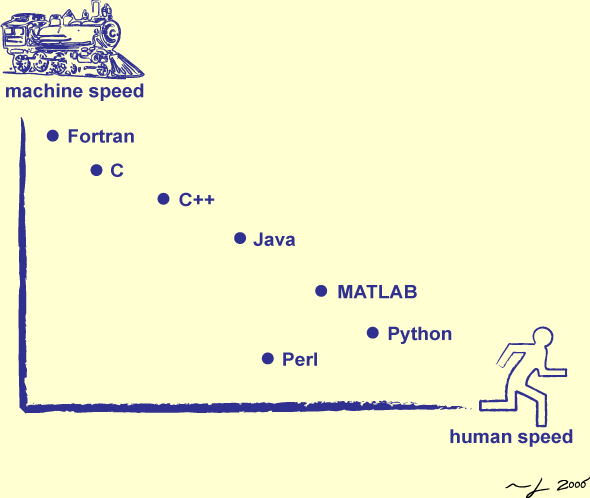

# Performing linear algebra (`ScaLAPACK`) in parallel from Python

Diagonalization of matrices is one of the most common and time-consuming linear algebra operations in scientific computing applications. There are well-established mathematical libraries, such as `LAPACK` (serial) and `ScaLAPACK` (parallel), that provide optimized solutions for this problem, often tailored for use on supercomputers. Although these libraries are implemented in Fortran, they also offer APIs for calling them from languages like C and C++.

- In this setup, we use Python with the `mpi4py` module for the front-end. Python, being an interpreted language, is highly suitable for quick prototyping and testing new ideas. However, it is slower compared to compiled languages like Fortran, C, or C++, which are converted into machine code for faster execution.

- For the backend, we opt for C++ over Fortran. While both are fast compiled languages, C++ offers greater flexibility for modern application development. We will utilize `ScaLAPACK`'s C bindings to access its functionality within C++.

- Parallelizing matrix computations with MPI is necessary, as real-world matrices are often too large for serial computation. Although GPU parallelization could yield even better performance, we focus on CPU parallelization for now.

- To integrate everything, we will use `SWIG` to bundle the C++ routines into Python modules. 

This approach allows us to combine the speed of compiled parallel C++/ScaLAPACK routines with the flexibility of Python, creating a streamlined and efficient solution for large-scale linear algebra operations.

<p align="center">

</p>
<p align="center">
<center><sup>https://www.cgl.ucsf.edu/Outreach/bmi219/slides/swc/lec/py01.html</sup></center>

## Workflow 

1. The C++ wrapper for one `ScaLAPACK`'s eigensolver routine is shown in `library/ParallelLinearAlgebra.cpp`. These C++ routines are compiled into a dynamic library, `libplinalg.so`, using the following command. 

   ```bash
   cd library/
   make all
   ```

2. Next, we aim to create a Python function, `pdsyev`, to compute the eigenvalues and eigenvectors of matrix `d`:
   ```python
   w = mymodule.pdsyev(comm, "input_string", d) 
   ```
   Behind the scenes, the Python function calls the C++ implementation defined in `cpp_functions.cpp`. The C++ function signature is:
   ```cpp
   Eigen::VectorXd pdsyev(MPI_Comm comm, const std::string &text, double *m2d,
                          int m2d_m, int m2d_n) 
   ```
   We use `SWIG` to compile the C++ function into a Python-callable. To do this, run the following command:
   ```bash
   sh ./compile.sh
   ```
   This generates the dynamic library `_mymodule.so`, which can be loaded directly from Python. 
  

3. Finally, we test the functionality by running `test_driver.py`:
   ```python
   from mpi4py import MPI
   import mymodule
   import numpy
   
   comm = MPI.COMM_WORLD
   rank = comm.Get_rank()
   
   d = numpy.array([[3,5,2,1],
                    [5,1,0,3],
                    [2,0,1,2],
                    [1,3,2,1]
                    ], dtype=numpy.double)
   
   w = mymodule.pdsyev(comm, "input_string", d) 
   
   if rank==0:
       print('Eigenvectors:')
       print(d)
       print('\nEigenvalues:')
       print(w)
   ```
   Since the `pdsyev` is an MPI parallel routine, we run the Python file using MPI:
   ```
   mpirun -np 4 test_driver.py
   ```
   The test successfully prints the eigenvalues and eigenvectors for matrix `d`, confirming that the parallelized routine works as expected.
   ```
   Eigenvectors:
   [[-0.49718297  0.44119429  0.33641001  0.66707196]
    [ 0.68625837 -0.32691264  0.29372946  0.5795693 ]
    [ 0.33524331  0.5263284  -0.73279059  0.27130847]
    [-0.4116679  -0.649195   -0.51338997  0.38145266]]
   
   Eigenvalues:
   [[-4.42203738]
    [ 0.20961624]
    [ 1.48303009]
    [ 8.72939105]]
   ```
